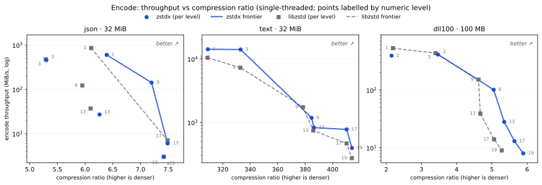
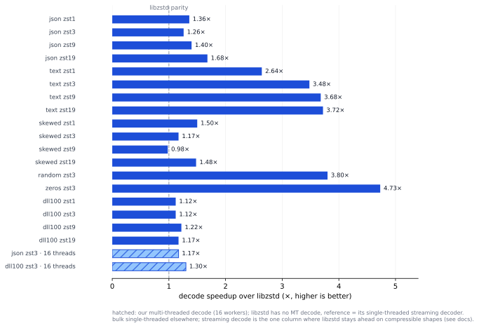

# Zstdx (a pure rust zstd format implementation)

A pure Rust implementation of the Zstandard compression format, focus on performance. Forked from KillingSpark/zstd-rs (ruzstd) with a from-scratch encoder; the decoder and encoder both cover the full format and interoperate with the reference C implementation in both directions.

- Decoder: complete, including dictionaries, multi-frame/skippable-frame streams, and checksum verification on every path.
- Encoder: the full numeric level ladder 0–22 (fast/dfast/chain/btlazy2/btopt/btultra strategy families modeled on libzstd's `clevels.h`), checksums, dictionaries (raw-content and `zstd --train`-style formatted), long-distance matching, and multithreaded compression.
- Multithreaded _decompression_ (restart-point parallel decode), which libzstd does not have.
- `no_std` + `alloc` capable; a `zstdx::compat` layer mirrors the [`zstd` crate](https://docs.rs/zstd)'s API shape (numeric levels, `io::Result`) for easy porting.

Performance is tracked against libzstd in `docs/src/dev/` ([snapshot](https://github.com/lxl66566/zstdx/blob/master/docs/src/dev/bench/snapshot.md)).

## Usage

One-shot:

```rust
let data = b"the quick brown fox jumps over the lazy dog";
let compressed = zstdx::bulk::compress(data, zstdx::Level::Fastest);
let restored = zstdx::bulk::decompress(&compressed, 0).unwrap();
assert_eq!(&restored[..], data);
```

Streaming over `io::Read`/`io::Write`:

```rust
use zstdx::io::{Read, Write};

let mut compressed = Vec::new();
let mut enc = zstdx::stream::write::Encoder::new(&mut compressed, zstdx::Level::Fast).unwrap();
enc.write_all(b"some payload").unwrap();
enc.finish().unwrap();

let mut restored = Vec::new();
zstdx::stream::read::Decoder::new(&compressed[..])
    .unwrap()
    .read_to_end(&mut restored)
    .unwrap();
assert_eq!(restored, b"some payload");
```

Options (checksum, pledged size, worker threads, dictionaries, forced window) are builder-style: `zstdx::EncoderOptions` / `zstdx::DecoderOptions`. See the [user guide](https://github.com/lxl66566/zstdx/blob/master/docs/src/user.md) for the full tour, and `docs.rs/zstdx` for the API reference.

## Feature flags

<!-- prettier-ignore -->
| Feature | Default | Effect |
|---|---|---|
| `std` | ✓ | `std::io` traits, threads, `compat` |
| `hash` | ✓ | XXH64 frame checksums (write + verify) |
| `dict_builder` | — | dictionary training (`zstdx::dict`) |

Without `std` the crate builds as `no_std` + `alloc`; bulk, streaming and the low-level APIs work, thread options report `Error::Unsupported`.

## Performance

Benchmarked against the `zstd` crate (libzstd 1.5.7) on 32 MiB corpus shapes plus a 100 MB real-binary payload (dll, concatenated system ELF binaries via [gen_big.sh](bench/gen_big.sh)); single-threaded unless noted, checksums off, every cell roundtrip-verified, ±10% run-to-run noise. Numbers read `ours / zstd` as throughput in MiB/s; **speedup** = zstd time ÷ zstdx time, so above 1× means zstdx finishes sooner. Full tables (streaming, MT, the 1-22 ladder): [snapshot.md](https://github.com/lxl66566/zstdx/blob/master/docs/src/dev/bench/snapshot.md).

Encode speed vs ratio — points labelled with the numeric level, curves are each side's Pareto frontier (upper right is better):



At equal ratio zstdx stays on or above the libzstd curve: on json, everything libzstd compresses between ratio 6.2 and 7.4 runs below 40 MiB/s while zstdx holds 142 MiB/s at ratio 7.2; on the dll payload it is 8–13% smaller than libzstd from level 9 up.

Decode speedup over libzstd (bulk; hatched bars are our multi-threaded decoder, a dimension libzstd does not have):



<!-- prettier-ignore -->
| level | shape | enc ST MiB/s | enc MT8 MiB/s | enc size | dec ST bulk MiB/s |
|---|---|---|---|---|---|
| 1 | json | 600 / 858 (0.70×) | 3702 / 4332 (0.85×) | −4.5% | 1731 / 1277 (1.36×) |
| 1 | text | 14212 / 10455 (1.36×) | 22185 / 11496 (1.93×) | −0.1% | 5971 / 2258 (2.64×) |
| 1 | skewed | 2962 / 1274 (2.32×) | 4302 / 3310 (1.30×) | 0.0% | 2310 / 1536 (1.50×) |
| 1 | dll | 392 / 530 (0.74×) | — | +1.8% | 1144 / 1023 (1.12×) |
| 3 | json | 458 / 477 (0.96×) | 2605 / 1069 (2.44×) | 0.0% | 1438 / 1144 (1.26×) |
| 3 | text | 14085 / 7275 (1.94×) | 12782 / 2319 (5.51×) | 0.0% | 8760 / 2515 (3.48×) |
| 3 | skewed | 210 / 224 (0.94×) | 1302 / 645 (2.02×) | 0.0% | 1246 / 1061 (1.17×) |
| 3 | dll | 411 / 434 (0.95×) | — | −2.2% | 1226 / 1094 (1.12×) |
| 9 | json | 142 / 122 (1.16×) | 337 / 204 (1.65×) | −17.4% | 1724 / 1231 (1.40×) |
| 9 | text | 1178 / 1734 (0.68×) | 855 / 1259 (0.68×) | −1.6% | 9364 / 2544 (3.68×) |
| 9 | skewed | 1860 / 75 (24.8×) | 699 / 122 (5.73×) | −8.1% | 650 / 660 (0.98×) |
| 9 | dll | 101 / 151 (0.67×) | — | −8.4% | 1527 / 1247 (1.22×) |
| 19 | json | 3 / 3 (0.90×) | — | −0.1% | 2166 / 1293 (1.68×) |
| 19 | text | 393 / 272 (1.45×) | — | 0.0% | 9382 / 2519 (3.72×) |
| 19 | skewed | 2 / 2 (0.92×) | — | 0.0% | 2203 / 1491 (1.48×) |
| 19 | dll | 8 / 9 (0.84×) | — | −10.5% | 1322 / 1134 (1.17×) |

Throughputs are rounded; speedups come from the measured medians. enc size = compressed-size change vs libzstd at the same numeric level (negative = zstdx smaller); MT8 = 8-worker encode, cold pool on both sides.

Compression-ratio geo-mean over the full sweep (5 shapes × 6 levels × bulk/stream × ST/MT): **+8.7% denser than libzstd** at matched numeric levels. MT decode (no libzstd counterpart) reaches 1.17× (json) and 1.30× (dll100) of libzstd's single-threaded streaming decode at 16 workers. The one decode column where libzstd stays ahead is streaming on compressible shapes; every raw table lives in the docs linked above.

Full per-level tables (1-22), methodology and noise caveats: [snapshot.md](https://github.com/lxl66566/zstdx/blob/master/docs/src/dev/bench/snapshot.md) and [matrix.md](https://github.com/lxl66566/zstdx/blob/master/docs/src/dev/bench/matrix.md).

## CLI

The companion `zstdx-cli` crate is a flag-compatible `zstd` command line (`zstdx file` → `file.zst`, `-d` to decode, `-1`..`-19`/`--fast`, `-T0`, `-D DICT`).

## Testing

Tests take two forms:

1. Tests using well-formed files that have to decode correctly and are checked against their originals, plus interop roundtrips against the reference implementation (dev-dependency on the `zstd` crate).
2. Tests using malformed input generated by the fuzzer; these don't have to decode (they are garbage) but must never panic the decoder.

## Fuzzing

The fuzz targets live in `crates/zstdx-fuzz` (`decode`, `decode_dict`, `encode`, `encode_stream`, `interop`, `fse`, `huff0`). From that directory, use `cargo +nightly fuzz run decode` (or another target) to run the fuzzer.

If the fuzzer finds a crash it will be saved to the artifacts dir by the fuzzer. Run `cargo test -p zstdx artifacts` to run the artifacts tests. This will tell you where the decoder panics exactly. If you are able to fix the issue please feel free to do a pull request. If not please still submit the offending input and I will see how to fix it myself.

## AI Contributions

Contributions may be created by using whatever tools you like. They must be read, verified and decided to be a value added to the project by a human (you! not a maintainer) before submitting a PR and the communication about the PR must be handled by a human and not an agent. This is meant to be more or less in the spirit of the [LLVM policy](https://llvm.org/docs/AIToolPolicy.html) adapted to a much smaller project.
